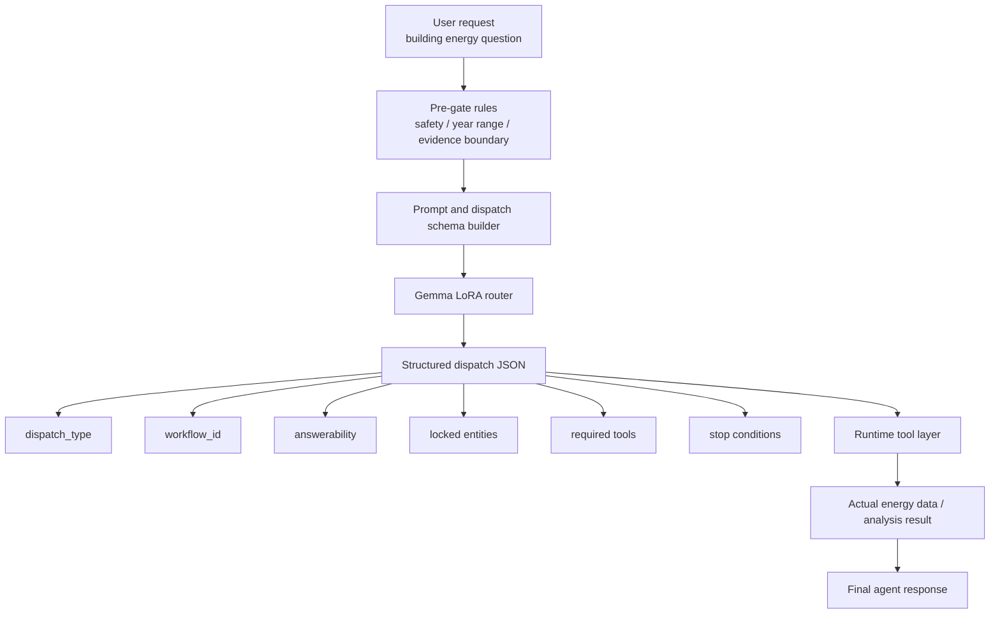
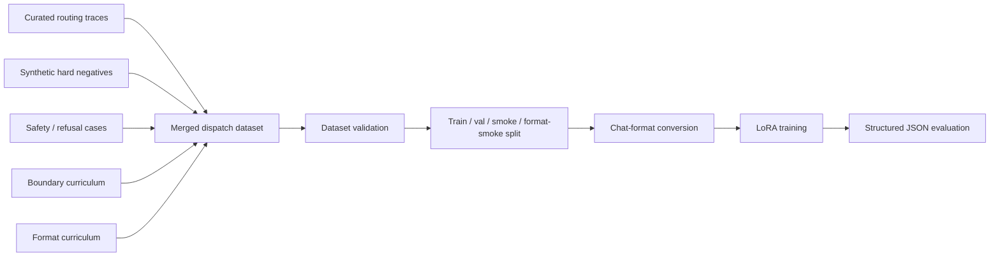
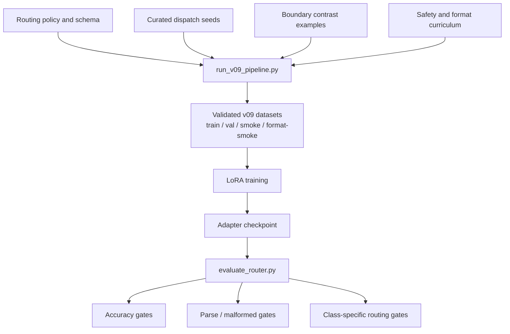

# ENERGY_LORA_GEMMA_2B

此 repository 目前聚焦於系統架構、訓練設計、版本演進與安全邊界，不包含原始資料、生成資料集、LoRA 權重、checkpoint、Notebook 輸出或任何可能洩漏真實校園電表資訊的檔案。

## English Overview

This repository documents the architecture and training design of a Gemma LoRA router for a building energy assistant. Instead of training the model to answer directly, the project trains it to emit a structured dispatch contract that decides whether a request is answerable, should be clarified, should be refused, or should trigger a single tool or a multi-step workflow.

The public repository keeps the system architecture, dataset design logic, evaluation philosophy, and safety boundaries, while excluding raw meter data, generated training sets, LoRA weights, checkpoints, and other sensitive artifacts.

## Current Status

- Status: In Progress
- Progress stage: late prototype for routing architecture and evaluation design
- Current stable line: `v09`
- Current focus: dispatch contract quality, structured JSON reliability, and boundary-aware routing
- Public repository scope: architecture, training design, and evaluation logic only

## 專案定位

這個專案不是一般聊天機器人微調，而是把 Gemma LoRA 用在「建築能源助理的路由與派工」。

目標是讓模型接到自然語言需求後，不直接編造答案，而是先輸出一份可執行的 dispatch contract，決定：

- 這個問題是否可回答
- 要不要先澄清
- 要不要拒答
- 應該呼叫單一工具還是多步 workflow
- 哪些 building / year / metric 是已鎖定實體

也就是說，這個專案訓練的不是答案模型，而是 agent router。

## 要解的問題

在建築能源場景中，很多問題看起來像一般問答，但實際上是工具編排問題，例如：

- 「幫我查某棟樓 2022 年的用電」
- 「比較兩棟樓去年 EUI」
- 「這個請求沒有足夠證據時要不要拒答」
- 「這個需求要跑單一查詢還是多步分析流程」

如果模型直接回答，很容易出現：

- 編造數字
- 年份超出資料範圍仍硬答
- 本來該澄清卻亂派工具
- 多步流程被誤判成單步
- JSON 結構不穩定，無法接進 agent runtime

所以整個系統被設計成「先做結構化派工，再由工具回傳真實數值」。

## 核心架構

這個架構最重要的原則是：

- LLM 只決定怎麼做
- 真正的數值答案來自工具
- 模型不能把訓練時看過的數據當成事實直接背出來

## 訓練資料管線

這個專案的難點之一，是資料不是單純 label classification，而是要把 agent 行為轉成可學習的 supervision。

資料集不是只有正例，還包含大量對比情境：

- `single_tool` vs `workflow_chain`
- `clarify_needed` vs `no_evidence`
- 可回答 vs 應拒答
- 合法年份 vs 超出資料邊界年份
- 格式正確但決策錯誤 vs 決策正確但格式錯誤

這種設計是為了把路由器最常犯的錯誤明確教給模型，而不是只靠一般 instruction tuning。

## 版本演進

### v02 - v04

早期版本聚焦在 strict tool router。

重點：

- 建立固定工具目錄映射
- 加入安全拒答與 hard negatives
- 建 dataset validator、confusion tracking、checkpoint 比較流程

### v05

這一版是架構轉折點，從「預測哪個 tool」升級成「輸出完整 dispatch contract」。

開始讓模型輸出：

- `dispatch_type`
- `workflow_id`
- `answerability`
- `locked entities`
- `required tools`
- `stop conditions`

這是我認為最有價值的一步，因為它把 agent routing 從單標籤分類改成可編排行為。

### v06 - v08

這幾版主要在修：

- prompt / data mismatch 造成的 parse error
- JSON schema 不穩
- `clarify_needed` 過度觸發
- `no_evidence`、`workflow_chain`、`single_tool` 邊界混淆

因此加入：

- dispatch-only prompting
- format curriculum
- contrast curriculum
- schema clarity 拆分
- boundary repair 資料

### v09

這是目前最成熟的修補版，也是此專案目前的主要穩定版本。

v09 的重點不是換更大模型，而是針對最關鍵的 routing 失敗模式做精修：

- `no_evidence` 優先於 actionable routing
- 移除會誤導模型的 placeholder wording
- 對超出資料年份的建築能源查詢先做 deterministic pre-gate
- 新增 `no_evidence` / `clarify_needed` / `single_tool` / `workflow_chain` 對比樣本
- 把 evaluation generation length 拉高，降低 JSON 被截斷的機率

## v09 工程架構圖

## 評估哲學

這個專案我不是只看 overall accuracy，而是把 router 當成 production component 來驗收。

主要關注：

- parse / malformed rate
- smoke set 正確率
- format smoke 正確率
- `no_evidence` 辨識能力
- `workflow_chain` vs `single_tool` 區分能力
- unsafe allow count
- over-refusal rate

這很重要，因為一個看起來分數不差的路由器，只要 JSON 常壞掉，就不能接進實際 agent runtime。

## 安全與資料邊界

這個專案特別值得展示的一點，是我從一開始就把資料邊界當成架構的一部分。

原則：

- GitHub 不放原始電表資料
- GitHub 不放生成 JSONL 訓練集
- GitHub 不放 model artifacts / adapters / checkpoints
- 訓練目標是 tool dispatch，不是背誦建物用電數值
- 真實數值必須由 runtime tool layer 回傳

也因此這個專案本質上同時包含了：

- LoRA 訓練
- agent routing
- evaluation harness
- privacy-aware ML packaging

## 技術能力亮點

- LoRA / QLoRA training workflow design
- agent dispatch schema design
- synthetic contrast dataset construction
- validation harness and smoke-gate thinking
- safety boundary design for sensitive numerical data
- prompt/data contract debugging

## Repository Scope

此 repository 不包含：

- 真實校園電表資料
- 生成的 dispatch JSONL
- LoRA adapter 與權重
- Colab / Notebook 產出
- 大型模型 artifact

目前保留的重點是：

- 我如何把問題定義對
- 我如何設計 supervision
- 我如何讓 agent router 可以被驗收
- 我如何處理結構化輸出失敗與資料邊界

## Further Directions

- 為什麼 router 要輸出 contract，而不是直接輸出 tool 名稱
- 如何處理 parse correctness 與 decision correctness 同時優化
- `no_evidence` 與 `clarify_needed` 的邊界怎麼教給模型
- 為什麼建築能源場景比一般客服路由更需要 pre-gate
- 如果要改成 production service，如何加入 constrained decoding 與 online trace review

## 備註

這個 repository 目前採用 architecture-focused README 形式。完整開發版原本包含多輪資料建構、訓練、評估與 artifact 管理，但相關內容不適合直接公開，因為涉及敏感數值資料、訓練產物與內部實驗資產。
